# Dicovery do Produto

Artefatos da parte de Discovery do produto. Resumo do formulário (Google Forms) apresentado aos membros da equipe de TI.

<h2>Questionário para descoberta do potencial do sistema web de 'Reuniões Diárias Remotas Assíncronas por Áudio'</h2>

O projeto visa criar um sistema web que permita aos membros de uma equipe de TI realizarem as Reuniões Diárias (Daily Meeting) por áudio de forma assíncrona, conforme os horários de início de jornada de cada um.

É para ser diferente do que só utilizar o WhatsApp, pois terá funcionalidades específicas. Além disso, oferece uma ferramenta oficial e dedicada para a empresa/equipe e facilita ao coordenador acompanhar o andamento da equipe. 

Pergunta 01: Você participa ou já participou de reuniões no estilo Daily Meeting (15 minutos no máximo)?
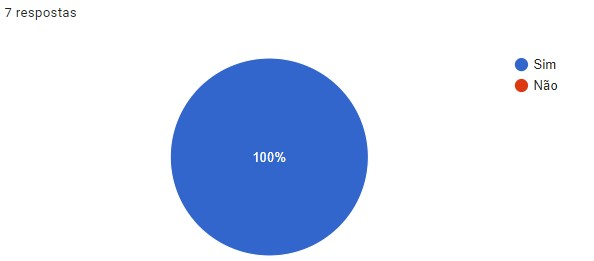

<h3>Reunião Diária - Presencial</h3>
Pergunta 02: Você participa ou já participou de reuniões diárias PRESENCIAIS?
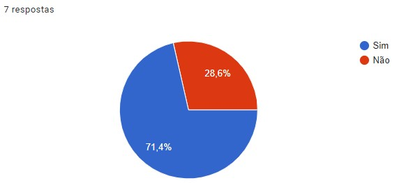

<h3>Reunião Diária - Presencial - Satisfação</h3>
Pergunta 03: Qual o seu grau de satisfação com este modo de reunião diária PRESENCIAL?

<small>Grau: (1) Muito Baixa a (5) Muito Alta</small>
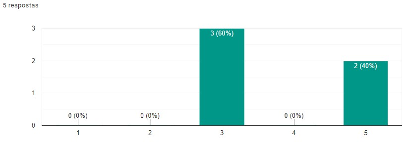

<h3>Reunião Diária - Remota por Vídeo</h3>
Pergunta 04: Você participa ou já participou de reuniões diárias Remotas por Vídeo?
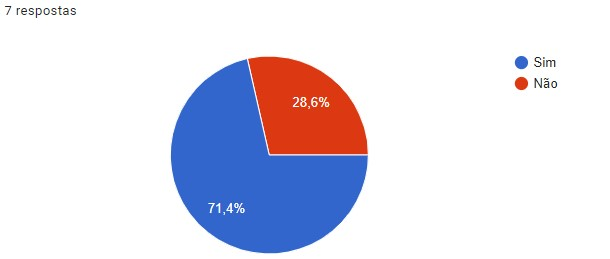

<h3>Reunião Diária - Remota por Vídeo - Satisfação</h3>
Pergunta 05: Qual o seu grau de satisfação com este modo de reunião diária Remota por Vídeo?

<small>Grau: (1) Muito Baixa a (5) Muito Alta</small>
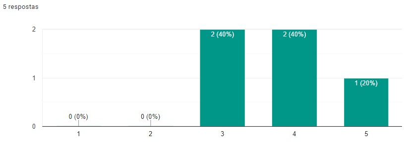

<h3>Reunião Diária - Remota por Áudio</h3>
Pergunta 06: Você participa ou já participou de reuniões diárias Remotas por Áudio?
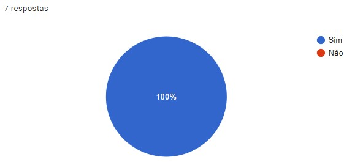

<h3>Reunião Diária - Remota por Áudio - Satisfação</h3>
Pergunta 07: Qual o seu grau de satisfação com este modo de reunião diária Remota por Áudio?

<small>Grau: (1) Muito Baixa a (5) Muito Alta</small>
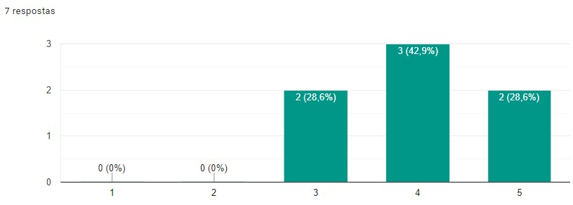

<h3>Todas as perguntas seguintes se referem ao uso da solução web "Reunião Remota Diária Assíncrona por Áudio".</h3>
<h4>(Perguntas 08 a 13) - Pensando como um <b>coordenador de equipe (Scrum Master)</b>, qual o grau de importância/utilidade você considera para as seguintes funcionalidades:<h4>

Funcionalidade 01: Relatório de utilização do sistema pela equipe
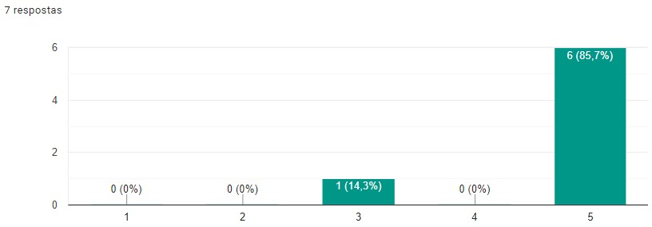
<small>Grau: (1) Pouco Importante a (5) Muito Importante</small>

<h3></h3>
Funcionalidade 02: Relatório de tempo dos áudios
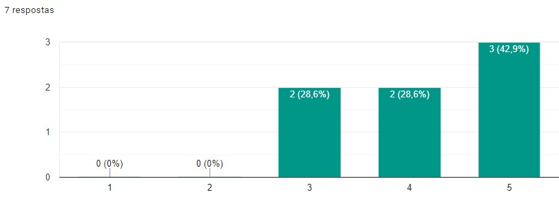
<small>Grau: (1) Pouco Importante a (5) Muito Importante</small>

<h3></h3>
Funcionalidade 03: Transcrição do áudio
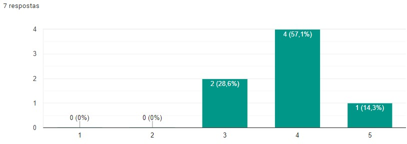
<small>Grau: (1) Pouco Importante a (5) Muito Importante</small>

<h3></h3>
Funcionalidade 04: Reconhecimento automático de nomes dos membros da equipe

<small>Grau: (1) Pouco Importante a (5) Muito Importante</small>

<h3></h3>
Funcionalidade 05: Associação de palavras-chave a projetos em andamento (integração com sistema gerenciador de projeto - Trello ou similar)
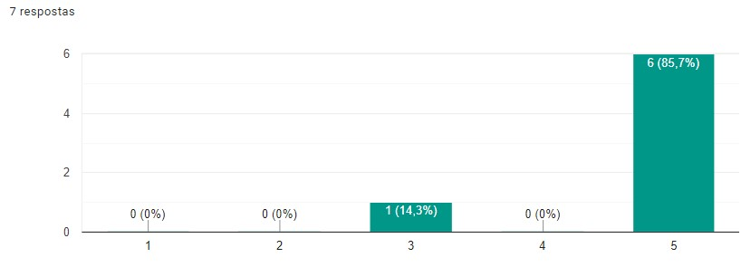
<small>Grau: (1) Pouco Importante a (5) Muito Importante</small>

Pergunta 13: Se preferir, cite outra(s) funcionalidade(s) que você, como Scrum Master/Coordenador, consideraria importante (4 respostas):

1. Reuniões são importantes, mas diárias acho exagero.

1. - Não só ter relatório mas alerta para que colaboradores façam o envio no período indicado (no início de sua jornada diária);
   - Entendo que poderia haver uma informação mais "condensada", com indicadores de participação e tempo médio dos áudios (um Dashboard ao invés do relatório, sendo o relatório um detalhamento do próprio dashboard)

1. Tópicos pré-definidos de assuntos que pode ser selecionado ao começar a mandar o Áudio, funcionária bem para equipes com mais de um projeto em paralelo (pode ser um acréscimo ao Penúltimo item dessa página)

1. Relatório de busca por palavras-chaves.

<h4>(Perguntas 14 a 21) - Pensando como um <b>membro da equipe</b>, qual o grau de importância você considera para as seguintes funcionalidades:</h4>
Funcionalidade 06: Gravar/escutar os áudios
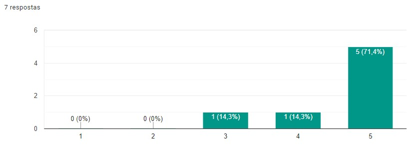
<small>Grau: (1) Pouco Importante a (5) Muito Importante</small>

<h3></h3>
Funcionalidade 07: Digitar texto (problemas com o áudio, deficiência auditiva)
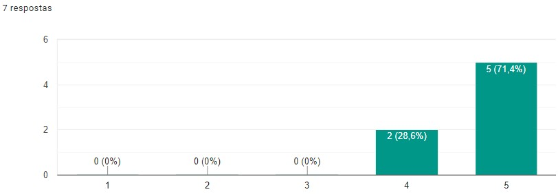
<small>Grau: (1) Pouco Importante a (5) Muito Importante</small>

<h3></h3>
Lembrete de envio do áudio diário
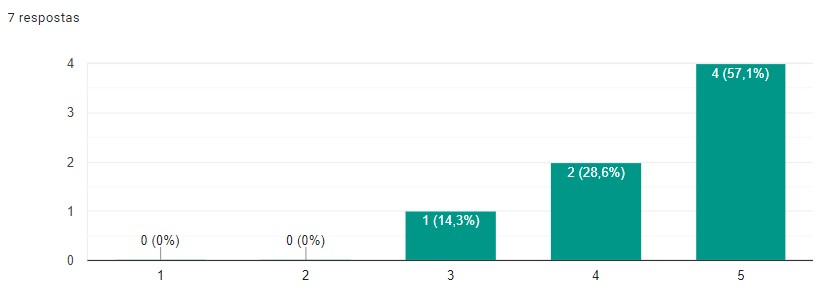
<small>Grau: (1) Pouco Importante a (5) Muito Importante</small>

<h3></h3>
Notificação ao receber áudio da equipe
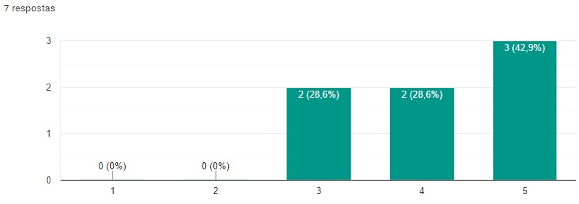
<small>Grau: (1) Pouco Importante a (5) Muito Importante</small>

<h3></h3>
Notificação diferenciada ao receber áudio em que você foi citado
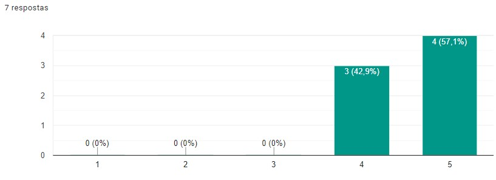
<small>Grau: (1) Pouco Importante a (5) Muito Importante</small>

<h3></h3>
Integração com aplicativo mobile (Telegram, por exemplo) para captura do áudio
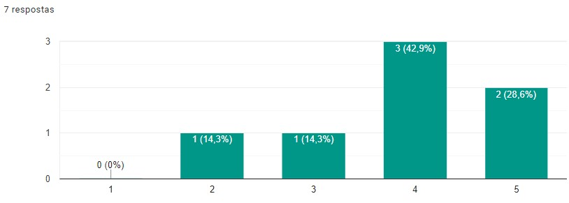
<small>Grau: (1) Pouco Importante a (5) Muito Importante</small>

<h3></h3>
Chat para alinhamento/início de resolução de problemas
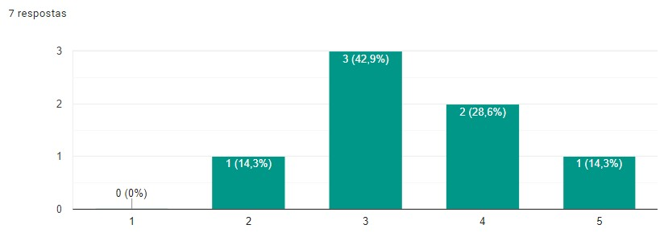
<small>Grau: (1) Pouco Importante a (5) Muito Importante</small>

Pergunta 21: Se preferir, cite outra(s) funcionalidade(s) que você, como membro da equipe, consideraria importante (2 respostas):

1. O item chat para alinhamento poderia ser uma opção interessante se ao invés de ter um chat no daily, pudesse levar a informação do daily com abertura de um chamado, separando assim uma tarefa (daily) de outra que pode ser bem maior de precisa de outro nível de acompanhamento

1. Lançar como demanda diária no app integrado Trello/Outro; Possibilidade de inativar usuário por período de férias/afastamento;
